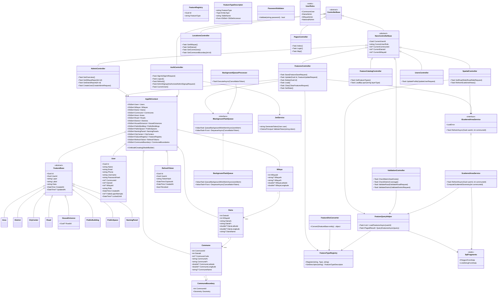

# NARS Backend - Class Diagram

```mermaid
classDiagram
    %% ===== ABSTRACT BASE =====
    class FeatureBase {
        <<abstract>>
        +Guid Id
        +Guid UserId
        +string Layer
        +string Label
        +string Data
        +DateTime CreatedAt
        +DateTime? UpdatedAt
    }

    %% ===== CONCRETE FEATURES =====
    class Area
    class District
    class CityCenter
    class Road
    class HouseEntrance {
        +Guid? RoadId
    }
    class PublicBuilding
    class PublicSpace
    class NamingPanel

    FeatureBase <|-- Area
    FeatureBase <|-- District
    FeatureBase <|-- CityCenter
    FeatureBase <|-- Road
    FeatureBase <|-- HouseEntrance
    FeatureBase <|-- PublicBuilding
    FeatureBase <|-- PublicSpace
    FeatureBase <|-- NamingPanel

    %% ===== FEATURE REGISTRY =====
    class FeatureRegistry {
        +Guid Id
        +string FeatureType
    }

    %% ===== LOCATION MODELS =====
    class User {
        +Guid Id
        +string Name
        +string Email
        +string Phone
        +string Username
        +string PasswordHash
        +int? CommuneId
        +int? DairaId
        +int? WilayaId
        +string Role
        +DateTime CreatedAt
        +int? FailedLoginAttempts
        +DateTime? LockedUntil
    }

    class Wilaya {
        +int WilayaId
        +string? WilayaAr
        +string? WilayaFr
        +double? WilayaLatitude
        +double? WilayaLongitude
    }

    class Daira {
        +int DairaId
        +int WilayaId
        +string DairaAr
        +string DairaFr
        +double? DairaLatitude
        +double? DairaLongitude
        +string? DairaName
    }

    class Commune {
        +int CommuneId
        +int DairaId
        +int? CommuneCode
        +string CommuneAr
        +string CommuneFr
        +double? CommuneLatitude
        +double? CommuneLongitude
        +string? CommuneName
    }

    class CommuneBoundary {
        +int CommuneId
        +Geometry Geometry
    }

    class RefreshToken {
        +Guid Id
        +Guid UserId
        +string TokenHash
        +DateTime ExpiresAt
        +DateTime CreatedAt
        +bool Revoked
    }

    Wilaya "1" --> "many" Daira
    Daira "1" --> "many" Commune
    Commune "1" --> "1" CommuneBoundary

    %% ===== DATABASE CONTEXT =====
    class AppDbContext {
        +DbSet~User~ Users
        +DbSet~Wilaya~ Wilayas
        +DbSet~Daira~ Dairas
        +DbSet~Commune~ Communes
        +DbSet~Area~ Areas
        +DbSet~Road~ Roads
        +DbSet~District~ Districts
        +DbSet~HouseEntrance~ HouseEntrances
        +DbSet~PublicBuilding~ PublicBuildings
        +DbSet~PublicSpace~ PublicSpaces
        +DbSet~NamingPanel~ NamingPanels
        +DbSet~CityCenter~ CityCenters
        +DbSet~FeatureRegistry~ FeatureRegistry
        +DbSet~RefreshToken~ RefreshTokens
        +DbSet~CommuneBoundary~ CommuneBoundaries
        +OnModelCreating(ModelBuilder)
    }

    AppDbContext o-- FeatureBase
    AppDbContext o-- User
    AppDbContext o-- Wilaya
    AppDbContext o-- Daira
    AppDbContext o-- Commune
    AppDbContext o-- RefreshToken

    %% ===== SERVICES =====
    class IScatteredAreaService {
        <<interface>>
        +Task RefreshAsync(Guid userId, int communeId)
        +LastError
    }

    class ScatteredAreaService {
        +Task RefreshAsync(Guid userId, int communeId)
        -ComputeScatteredGeometry(int communeId)
    }

    IScatteredAreaService <|.. ScatteredAreaService

    class JwtService {
        +string GenerateToken(User user)
        +ClaimsPrincipal ValidateToken(string token)
    }

    class IBackgroundTaskQueue {
        <<interface>>
        +ValueTask QueueBackgroundWorkItemAsync(workItem)
        +ValueTask~Func~ DequeueAsync(CancellationToken)
    }

    class BackgroundTaskQueue {
        +ValueTask QueueBackgroundWorkItemAsync(workItem)
        +ValueTask~Func~ DequeueAsync(CancellationToken)
    }

    class BackgroundQueueProcessor {
        +Task ExecuteAsync(CancellationToken)
    }

    IBackgroundTaskQueue <|.. BackgroundTaskQueue
    BackgroundQueueProcessor --> IBackgroundTaskQueue

    %% ===== INFRASTRUCTURE =====
    class FeatureTypeRegistry {
        +Register(string, Type, string)
        +GetDescriptor(string) FeatureTypeDescriptor
    }

    class FeatureTypeDescriptor {
        +string FeatureType
        +Type EntityType
        +string TableName
        +Func~DbSet~ DbSetAccessor
    }

    class FeatureQueryHelper {
        +Task~List~ LoadFeaturesAsync(userId)
        +Task~PagedResult~ QueryFeaturesAsync(query)
    }

    class PasswordValidator {
        +Validate(string password) bool
    }

    class SqlFragments {
        <<static>>
        +PolygonFromData
        +LineStringFromData
    }

    class FeatureDtoConverter {
        +Convert(FeatureBase entity) object
    }

    class UserRoles {
        <<static>>
        +CommuneUser
        +DairaAdmin
        +WilayaAdmin
        +NationalAdmin
    }

    ScatteredAreaService --> FeatureQueryHelper
    ScatteredAreaService --> SqlFragments
    FeatureQueryHelper --> SqlFragments
    FeatureQueryHelper --> FeatureTypeRegistry
    FeatureDtoConverter --> FeatureTypeRegistry

    %% ===== CONTROLLERS =====
    class ControllerBase {
        <<abstract>>
    }

    class NarsControllerBase {
        <<abstract>>
        +Guid CurrentUserId
        +string CurrentUserRole
        +int? CurrentCommuneId
        +int? CurrentDairaId
        +int? CurrentWilayaId
    }

    class AuthController {
        +Task SignIn(SignInRequest)
        +Task Logout()
        +Task Refresh()
        +Task AdminSignup(AuthorizedAdminSignupRequest)
        +Task CurrentUser()
    }

    class AdminController {
        +Task GetOverview()
        +Task GetWilayaReport(int id)
        +Task GetDairaReport(int id)
        +Task CreateUser(CreateAdminRequest)
    }

    class FeaturesController {
        +Task Save(FeatureSaveRequest)
        +Task Update(Guid id, FeatureUpdateRequest)
        +Task Delete(Guid id)
        +Task Load()
        +Task Clear(ClearFeaturesRequest)
        +Task GetStats()
    }

    class FeatureCatalogController {
        +Task GetFeatureTypes()
        +Task LoadByLayer(string layerType)
    }

    class ValidationController {
        +Task CheckMainUrbanExists()
        +Task CheckDistrictCoverage()
        +Task ValidateRoad(ValidateRoadRequest)
        +Task ValidateDistrict(ValidateDistrictRequest)
    }

    class SpatialController {
        +Task GetRoadSide(RoadSideRequest)
        +Task RefreshScatteredAreas()
    }

    class LocationsController {
        +Task GetWilayas()
        +Task GetDairas()
        +Task GetCommunes()
        +Task GetCommuneBoundary(int id)
    }

    class UsersController {
        +Task UpdateProfile(UpdateUserRequest)
    }

    class PagesController {
        +Task Index()
        +Task Login()
        +Task Map()
    }

    ControllerBase <|-- NarsControllerBase
    ControllerBase <|-- AuthController
    ControllerBase <|-- LocationsController
    ControllerBase <|-- PagesController

    NarsControllerBase <|-- AdminController
    NarsControllerBase <|-- FeaturesController
    NarsControllerBase <|-- FeatureCatalogController
    NarsControllerBase <|-- ValidationController
    NarsControllerBase <|-- SpatialController
    NarsControllerBase <|-- UsersController

    AuthController --> JwtService
    AuthController --> AppDbContext
    AdminController --> AppDbContext
    FeaturesController --> AppDbContext
    FeaturesController --> IScatteredAreaService
    FeaturesController --> IBackgroundTaskQueue
    FeaturesController --> FeatureTypeRegistry
    ValidationController --> FeatureQueryHelper
    SpatialController --> IScatteredAreaService
    SpatialController --> FeatureQueryHelper
```
