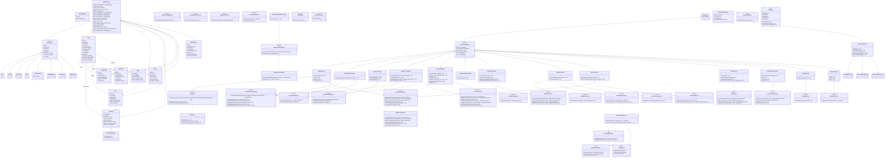

# NARS Backend - Class Diagram

```mermaid
classDiagram
    %% ===== ABSTRACT BASE =====
    class FeatureBase {
        <<abstract>>
        +Guid Id
        +Guid UserId
        +string Layer
        +string Label
        +string Data
        +DateTime CreatedAt
        +DateTime? UpdatedAt
        +uint Version
    }

    %% ===== CONCRETE FEATURES =====
    class Area
    class District
    class CityCenter
    class Road
    class HouseEntrance {
        +Guid? RoadId
    }
    class PublicBuilding
    class PublicSpace
    class NamingPanel

    FeatureBase <|-- Area
    FeatureBase <|-- District
    FeatureBase <|-- CityCenter
    FeatureBase <|-- Road
    FeatureBase <|-- HouseEntrance
    FeatureBase <|-- PublicBuilding
    FeatureBase <|-- PublicSpace
    FeatureBase <|-- NamingPanel

    %% ===== FEATURE REGISTRY =====
    class FeatureRegistry {
        +Guid Id
        +string FeatureType
    }

    %% ===== NON-FEATURE MODELS =====
    class Inspection {
        +Guid Id
        +Guid UserId
        +Guid FeatureId
        +string FeatureType
        +string Status
        +string? Notes
        +DateTime CreatedAt
    }

    class ErrorLog {
        +Guid Id
        +Guid UserId
        +string Level
        +string Message
        +string? Source
        +string? StackTrace
        +DateTime CreatedAt
    }

    class AiDraftFeature {
        +Guid Id
        +string FeatureType
        +string Status
        +int CommuneId
        +string? GeometryJson
        +string? Label
        +DateTime CreatedAt
        +DateTime? UpdatedAt
    }

    %% ===== LOCATION MODELS =====
    class User {
        +Guid Id
        +string Name
        +string Email
        +string Phone
        +string Username
        +string PasswordHash
        +int? CommuneId
        +int? DairaId
        +int? WilayaId
        +string Role
        +DateTime CreatedAt
        +int? FailedLoginAttempts
        +DateTime? LockedUntil
        +string SecurityStamp
    }

    class Wilaya {
        +int WilayaId
        +string? WilayaAr
        +string? WilayaFr
        +double? WilayaLatitude
        +double? WilayaLongitude
    }

    class Daira {
        +int DairaId
        +int WilayaId
        +string DairaAr
        +string DairaFr
        +double? DairaLatitude
        +double? DairaLongitude
        +string? DairaName
    }

    class Commune {
        +int CommuneId
        +int DairaId
        +int? CommuneCode
        +string CommuneAr
        +string CommuneFr
        +double? CommuneLatitude
        +double? CommuneLongitude
        +string? CommuneName
    }

    class CommuneBoundary {
        +int CommuneId
        +Geometry Geometry
    }

    class RefreshToken {
        +Guid Id
        +Guid UserId
        +string TokenHash
        +DateTime ExpiresAt
        +DateTime CreatedAt
        +bool Revoked
    }

    User "1" --> "0..*" RefreshToken : has
    User "1" --> "0..*" Inspection : creates
    User "1" --> "0..*" ErrorLog : creates
    User --> Commune : CommuneId?
    User --> Daira : DairaId?
    User --> Wilaya : WilayaId?

    Wilaya "1" --> "0..*" Daira
    Daira "1" --> "0..*" Commune
    Commune "1" --> "0..1" CommuneBoundary

    %% ===== DATABASE CONTEXT =====
    class AppDbContext {
        +DbSet~FeatureRegistry~ FeatureRegistry
        +DbSet~Area~ Areas
        +DbSet~District~ Districts
        +DbSet~CityCenter~ CityCenters
        +DbSet~Road~ Roads
        +DbSet~HouseEntrance~ HouseEntrances
        +DbSet~PublicBuilding~ PublicBuildings
        +DbSet~PublicSpace~ PublicSpaces
        +DbSet~NamingPanel~ NamingPanels
        +DbSet~Inspection~ Inspections
        +DbSet~ErrorLog~ ErrorLogs
        +DbSet~User~ Users
        +DbSet~RefreshToken~ RefreshTokens
        +DbSet~Wilaya~ Wilayas
        +DbSet~Daira~ Dairas
        +DbSet~Commune~ Communes
        +DbSet~CommuneBoundary~ CommuneBoundaries
        +DbSet~AiDraftFeature~ AiDraftFeatures
    }

    AppDbContext o-- FeatureBase
    AppDbContext o-- User
    AppDbContext o-- Wilaya
    AppDbContext o-- Daira
    AppDbContext o-- Commune
    AppDbContext o-- RefreshToken
    AppDbContext o-- Inspection
    AppDbContext o-- ErrorLog
    AppDbContext o-- AiDraftFeature

    %% ===== SERVICES =====
    class IJwtService {
        <<interface>>
        +CreateToken(userId, username, name, email, communeId, securityStamp, role, dairaId, wilayaId) string
        +ValidateToken(string) ClaimsPrincipal?
        +CreateRefreshToken() (string raw, string hash)
    }

    class JwtService {
        +CreateToken(...) string
        +ValidateToken(string) ClaimsPrincipal?
        +CreateRefreshToken() (string raw, string hash)
    }
    IJwtService <|.. JwtService

    class IRefreshTokenService {
        <<interface>>
        +IssueRefreshTokenAsync(userId) RefreshTokenResult
        +RotateRefreshTokenAsync(rawToken) RefreshTokenResult
        +MintAccessTokenAsync(rawToken) RefreshTokenResult
        +RecordFailedLoginAsync(userId) Task
        +ResetFailedAttemptsIfNeededAsync(user) Task
        +PruneExpiredTokensAsync() Task
    }

    class RefreshTokenService {
        +IssueRefreshTokenAsync(userId) RefreshTokenResult
        +RotateRefreshTokenAsync(rawToken) RefreshTokenResult
        +MintAccessTokenAsync(rawToken) RefreshTokenResult
        +RecordFailedLoginAsync(userId) Task
        +ResetFailedAttemptsIfNeededAsync(user) Task
        +PruneExpiredTokensAsync() Task
    }
    IRefreshTokenService <|.. RefreshTokenService

    class IFeatureService {
        <<interface>>
        +SaveFeatureAsync(request, userId) CreateResponse
        +UpdateFeatureAsync(id, request, userId) UpdateFeatureResponse
        +DeleteFeatureAsync(id, userId) Task
        +LoadFeaturesAsync(userId, skip, take) LoadFeaturesResponse
        +LoadByLayerAsync(userId, layer, skip, take) LoadFeaturesResponse
        +ClearFeaturesAsync(request, userId) Task
        +GetStatsAsync(userId) FeatureStatsResponse
    }

    class IFeatureStatsService {
        <<interface>>
        +GetStatsAsync(userId) FeatureStatsResponse
    }

    class IFeatureCleanupService {
        <<interface>>
        +DeleteAllUserFeaturesAsync(userId) Task
    }

    class IUserAuthorizationService {
        <<interface>>
        +VerifyCredentialsAsync(username, password, maxAttempts, lockoutMinutes) CredentialResult
        +GetUserClaimsAsync(user) IEnumerable~Claim~
        +CreateManagedUserAsync(request, creatorId) Task
        +UpdateManagedUserAsync(userId, request, callerId) Task
        +DeleteManagedUserAsync(userId, callerId) Task
        +GetManageableUsersAsync(callerId) IEnumerable~UserInfo~
    }

    class IUserCreationService {
        <<interface>>
        +CreateUserAsync(request, creatorId) Task~User~
        +CreateAdminAsync(request) Task~User~
    }

    class IUserProfileService {
        <<interface>>
        +UpdateProfileAsync(userId, request) UserInfo
        +UpdateCredentialsAsync(userId, request) UpdateCredentialsResponse
    }

    class IValidationService {
        <<interface>>
        +CheckMainUrbanExistsAsync(userId) MainUrbanExistsResponse
        +CheckDistrictCoverageAsync(userId) DistrictCoverageResponse
        +ValidateRoadAsync(request, userId) ValidateRoadResponse
        +ValidateDistrictAsync(request, userId) ValidateDistrictResponse
    }

    class IFieldService {
        <<interface>>
        +GetFeaturesAsync(userId) IEnumerable~FieldFeatureResult~
        +InspectAsync(request, userId) FieldInspectionResponse
        +GetInspectionsAsync(featureId, userId) FieldInspectionsResponse
        +CreateEntranceAsync(request, userId) FeatureResult
    }

    class IScatteredAreaService {
        <<interface>>
        +RefreshAsync(userId, communeId, ct) Task~bool~
        +GetLastError(userId, communeId) (DateTimeOffset, string)?
    }

    class ScatteredAreaService {
        +RefreshAsync(userId, communeId, ct) Task~bool~
        +GetLastError(userId, communeId) (DateTimeOffset, string)?
    }
    IScatteredAreaService <|.. ScatteredAreaService

    class IRoadQueryService {
        <<interface>>
        +GetRoadSideAsync(request, userId) RoadSideResponse
    }

    class IEntranceQueryService {
        <<interface>>
        +SuggestEntranceNumberAsync(roadId, lat, lng) int
    }

    class IAdminOverviewService {
        <<interface>>
        +GetOverviewAsync(skip, take) NationalOverviewResponse
        +GetWilayaAsync(wilayaId) WilayaReport
        +GetDairaAsync(dairaId) DairaReport
    }

    class IErrorLogService {
        <<interface>>
        +SubmitLogsAsync(batch, userId) Task
    }

    class ICommuneScopeService {
        <<interface>>
        +GetCommuneIdAsync(userId) int?
    }

    class IDraftFeaturesService {
        <<interface>>
        +SegmentTileAsync(request, userId) SegmentSummaryResponse
        +ListAsync(userId) IEnumerable~AiDraftFeatureDto~
        +AcceptAsync(id, userId) Task
        +RejectAsync(id, userId) Task
    }

    class ISegmentationClient {
        <<interface>>
        +SegmentAsync(tileData, ct) SegmentationResult
    }

    class ISecurityStampCache {
        <<interface>>
        +GetStampAsync(userId) Task~string?
        +EvictStamp(userId) Task
    }

    class IPageAuthService {
        <<interface>>
        +TryAuthenticateAsync(HttpContext) Task~bool~
    }

    class IBackgroundTaskQueue {
        <<interface>>
        +QueueBackgroundWorkItemAsync(workItem) ValueTask~bool~
        +DequeueAsync(ct) ValueTask~Func~
    }

    class BackgroundTaskQueue {
        +QueueBackgroundWorkItemAsync(workItem) ValueTask~bool~
        +DequeueAsync(ct) ValueTask~Func~
    }
    IBackgroundTaskQueue <|.. BackgroundTaskQueue

    class BackgroundQueueProcessor {
        +ExecuteAsync(ct) Task
    }
    BackgroundQueueProcessor --> IBackgroundTaskQueue

    class ILogSanitizer {
        <<interface>>
        +Sanitize(message) string
    }

    class IDateTimeProvider {
        <<interface>>
        +UtcNow DateTime
    }

    %% ===== CONTROLLERS =====
    class ControllerBase {
        <<abstract>>
    }

    class NarsControllerBase {
        <<abstract>>
        #Guid? CurrentUserId
        #Guid RequiredCurrentUserId
        #string CurrentUserRole
        #int? CurrentCommuneId
        #int? CurrentDairaId
        #int? CurrentWilayaId
    }

    class AuthController {
        +SignIn(SignInRequest) Task
        +Logout() Task
        +Refresh() Task
        +CurrentUser() Task
    }

    class AdminSignupController {
        +AdminSignup(AuthorizedAdminSignupRequest) Task
    }

    class AdminController {
        +Overview(skip, take) Task
        +GetWilaya(wilayaId) Task
        +GetDaira(dairaId) Task
    }

    class AdminUserController {
        +CreateManagedUser(CreateAdminRequest) Task
        +GetManageableUsers() Task
        +UpdateManagedUser(userId, UpdateAdminRequest) Task
        +DeleteManagedUser(userId) Task
    }

    class FeaturesController {
        +Save(FeatureSaveRequest) Task
        +Update(id, FeatureUpdateRequest) Task
        +Delete(id) Task
        +Load(skip, take) Task
        +LoadByLayer(layerType, skip, take) Task
        +Clear(ClearFeaturesRequest) Task
        +GetStats() Task
    }

    class FeatureCatalogController {
        +GetFeatureTypes() Task
    }

    class ValidationController {
        +CheckMainUrbanExists() Task
        +CheckDistrictCoverage() Task
        +ValidateRoad(ValidateRoadRequest) Task
        +ValidateDistrict(ValidateDistrictRequest) Task
    }

    class SpatialController {
        +GetRoadSide(RoadSideRequest) Task
        +RefreshScattered() Task
    }

    class LocationsController {
        +GetWilayas() Task
        +GetDairas(wilayaId?) Task
        +GetCommunes(dairaId?) Task
        +GetCommuneBoundary(id) Task
        +SearchLocations(query) Task
    }

    class UsersController {
        +UpdateProfile(UpdateUserRequest) Task
        +UpdateCredentials(UpdateCredentialsRequest) Task
    }

    class FieldController {
        +GetFeatures() Task
        +Inspect(FieldInspectRequest) Task
        +GetInspections(featureId) Task
        +CreateEntrance(FieldEntranceCreateRequest) Task
    }

    class DraftFeaturesController {
        +Segment(SegmentTileRequest) Task
        +List() Task
        +Accept(id) Task
        +Reject(id) Task
    }

    class LogsController {
        +SubmitLogs(LogBatch) Task
    }

    class PagesController {
        +Index() Task
        +Login() Task
        +Map() Task
    }

    ControllerBase <|-- NarsControllerBase
    ControllerBase <|-- LocationsController

    NarsControllerBase <|-- AuthController
    NarsControllerBase <|-- AdminSignupController
    NarsControllerBase <|-- AdminController
    NarsControllerBase <|-- AdminUserController
    NarsControllerBase <|-- FeaturesController
    NarsControllerBase <|-- FeatureCatalogController
    NarsControllerBase <|-- ValidationController
    NarsControllerBase <|-- SpatialController
    NarsControllerBase <|-- UsersController
    NarsControllerBase <|-- FieldController
    NarsControllerBase <|-- DraftFeaturesController
    NarsControllerBase <|-- LogsController
    NarsControllerBase <|-- PagesController

    %% ===== CONTROLLER DEPENDENCIES =====
    AuthController --> IJwtService
    AuthController --> IRefreshTokenService
    AuthController --> IUserAuthorizationService
    AdminSignupController --> IUserCreationService
    AdminSignupController --> IUserAuthorizationService
    AdminController --> IAdminOverviewService
    AdminUserController --> IUserAuthorizationService
    AdminUserController --> IUserCreationService
    FeaturesController --> IFeatureService
    FeaturesController --> IFeatureStatsService
    ValidationController --> IValidationService
    SpatialController --> IRoadQueryService
    SpatialController --> IScatteredAreaService
    SpatialController --> IEntranceQueryService
    FieldController --> IFieldService
    LocationsController --> IBoundaryService
    LocationsController --> ILocationQueryService
    LocationsController --> ILocationSearchService
    UsersController --> IUserProfileService
    UsersController --> IRefreshTokenService
    DraftFeaturesController --> IDraftFeaturesService
    PagesController --> IPageAuthService
    LogsController --> IErrorLogService

    %% ===== INFRASTRUCTURE =====
    class FeatureTypeRegistry {
        <<static>>
        +GetDescriptor(string) FeatureTypeDescriptor
        +GetAllDescriptors() FeatureTypeDescriptor[]
        +IsValidTableName(string) bool
    }

    class FeatureTypeDescriptor {
        +string FeatureType
        +Type EntityType
        +string TableName
        +Func~DbSet~ DbSetAccessor
    }

    class FeatureQueryHelper {
        <<static>>
        +LoadAllFeaturesAsync(conn, userId, skip, take, ct)
        +LoadByLayerAsync(conn, userId, layer, skip, take, ct)
    }

    class PasswordValidator {
        <<static>>
        +Validate(string password) string?
    }

    class SqlFragments {
        <<static>>
        +PolygonFromDataTemplate
        +LineStringFromDataTemplate
        +UrbanAreaLayersSqlIn
    }

    class UserRoles {
        <<static>>
        +CommuneUser
        +DairaAdmin
        +WilayaAdmin
        +NationalAdmin
        +FieldWorker
        +IsAdmin(string) bool
        +IsDraftReviewer(string) bool
        +IsCommuneScoped(string) bool
    }

    ScatteredAreaService --> FeatureQueryHelper
    ScatteredAreaService --> SqlFragments
    FeatureQueryHelper --> SqlFragments
    FeatureQueryHelper --> FeatureTypeRegistry
```
