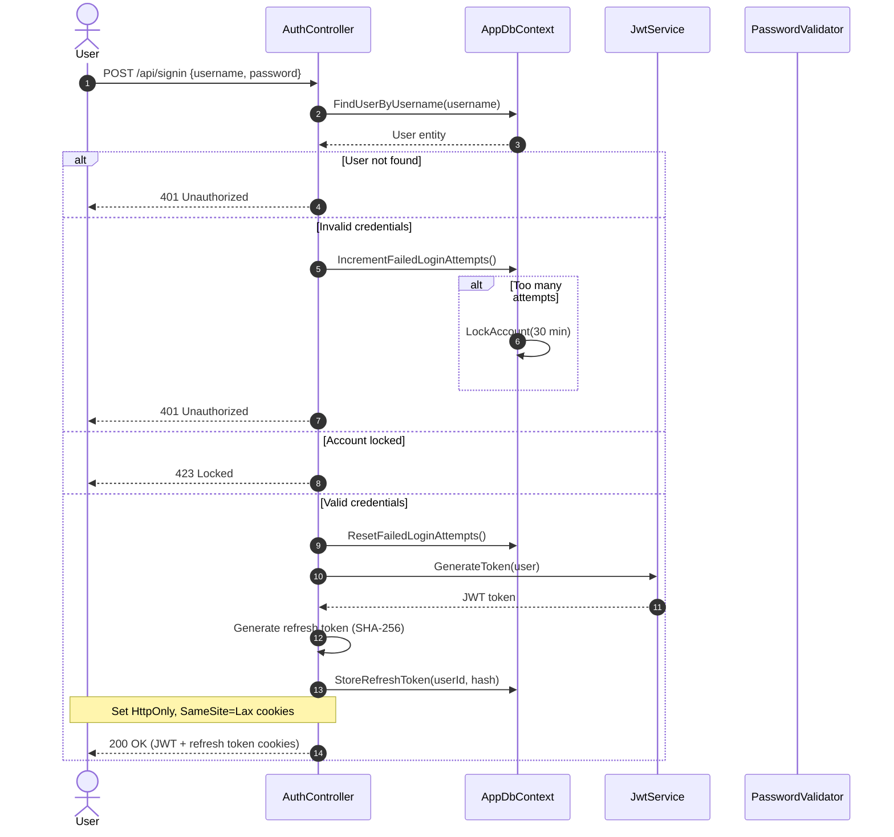
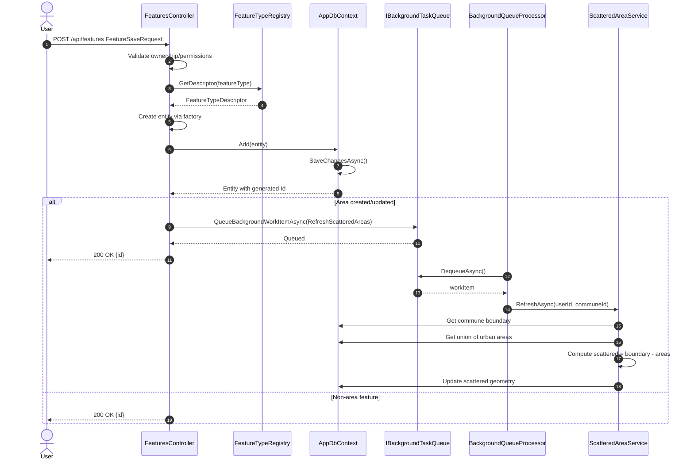
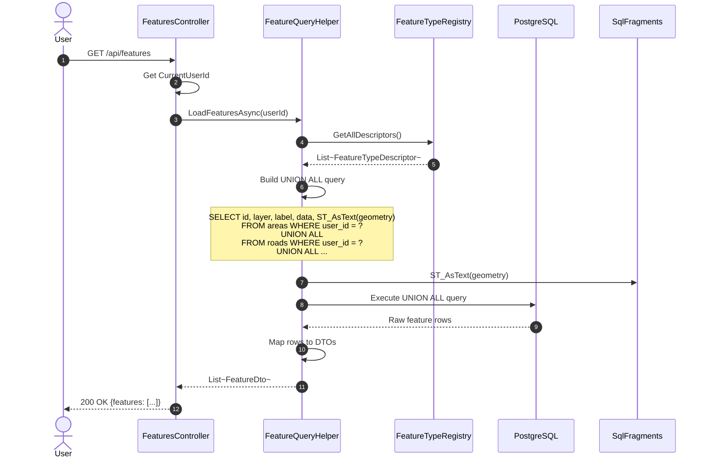
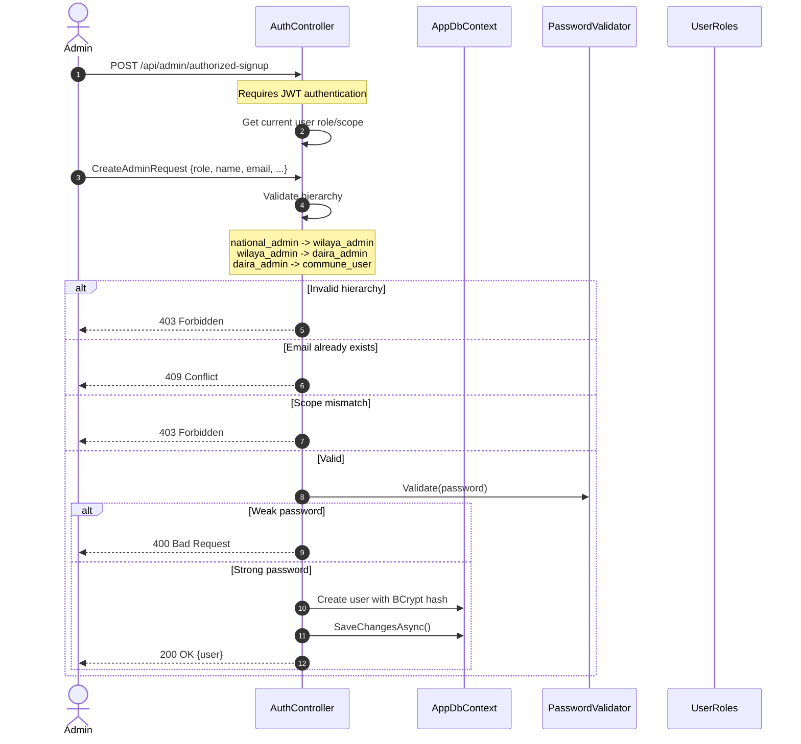
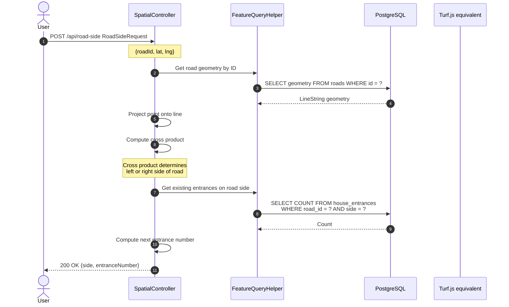

# NARS Backend - Sequence Diagrams

## 1. Authentication Flow

## 2. Feature Creation Flow

## 3. Feature Load Flow (Cross-Table Query)

## 4. Admin User Creation Flow

## 5. Road-Side Determination Flow

