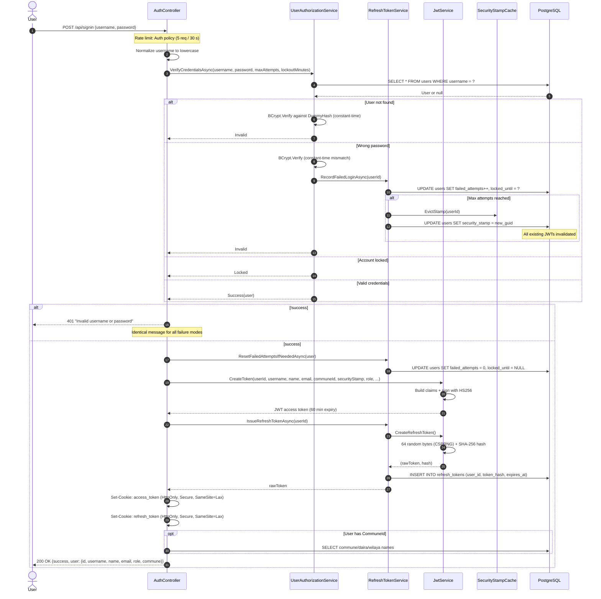
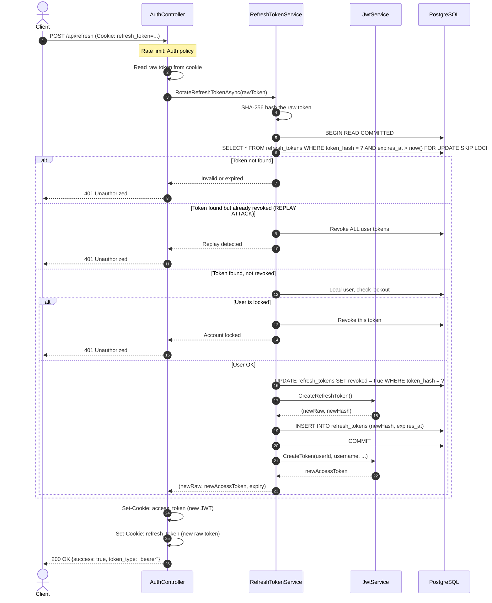
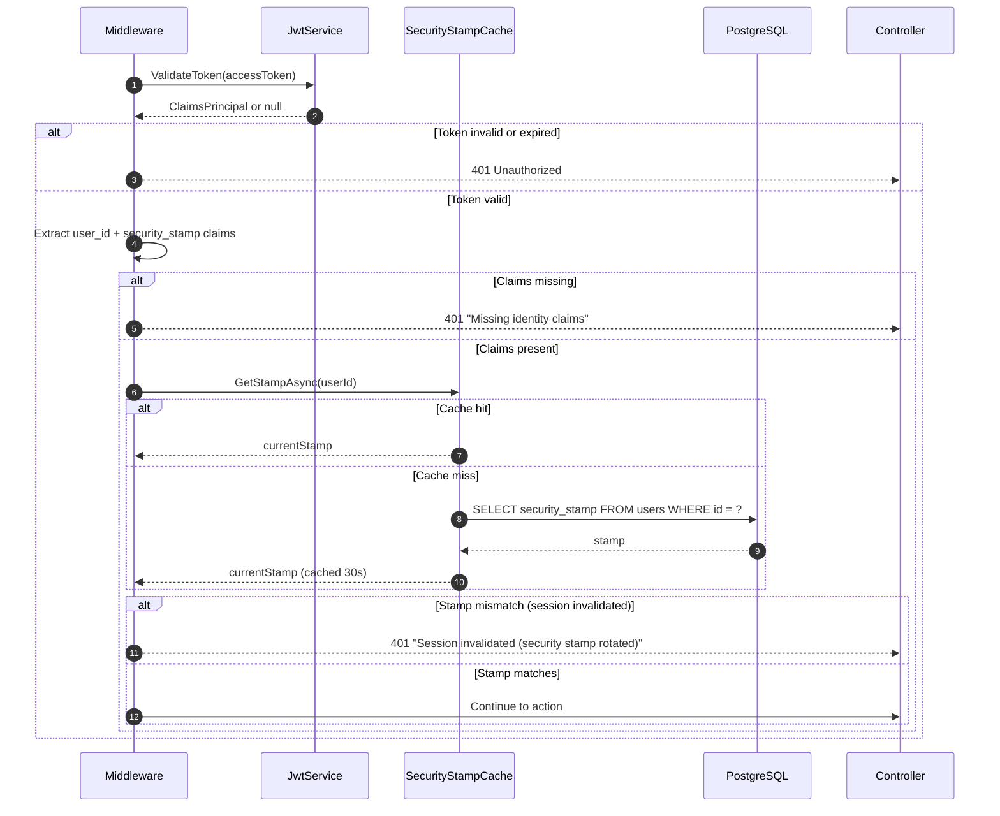
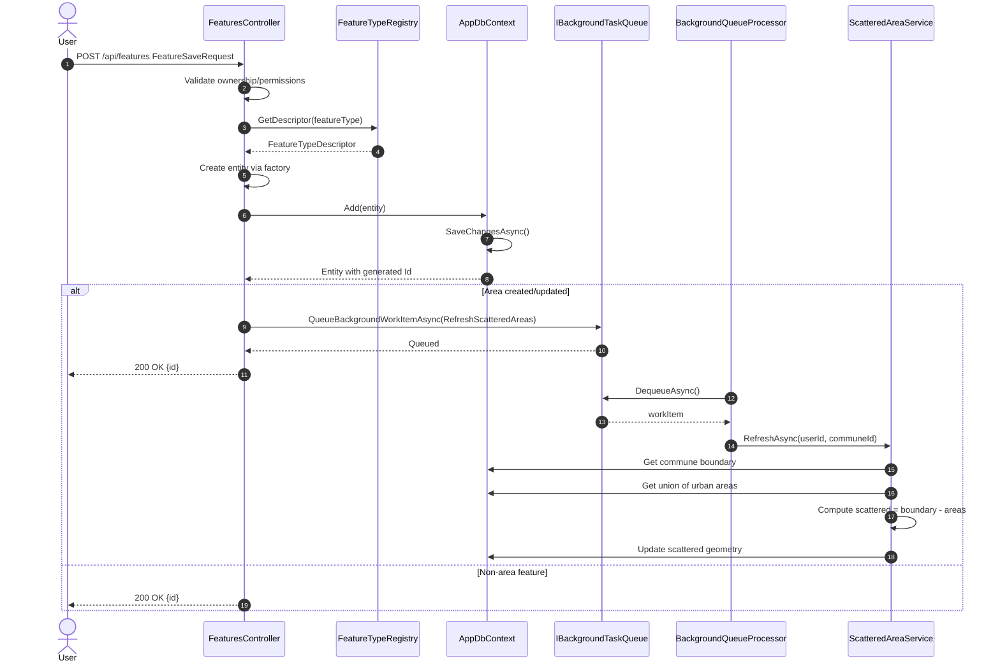
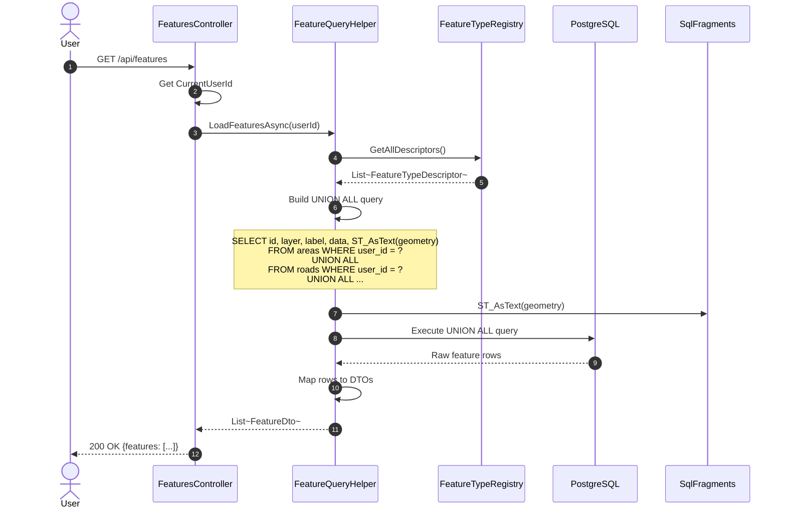
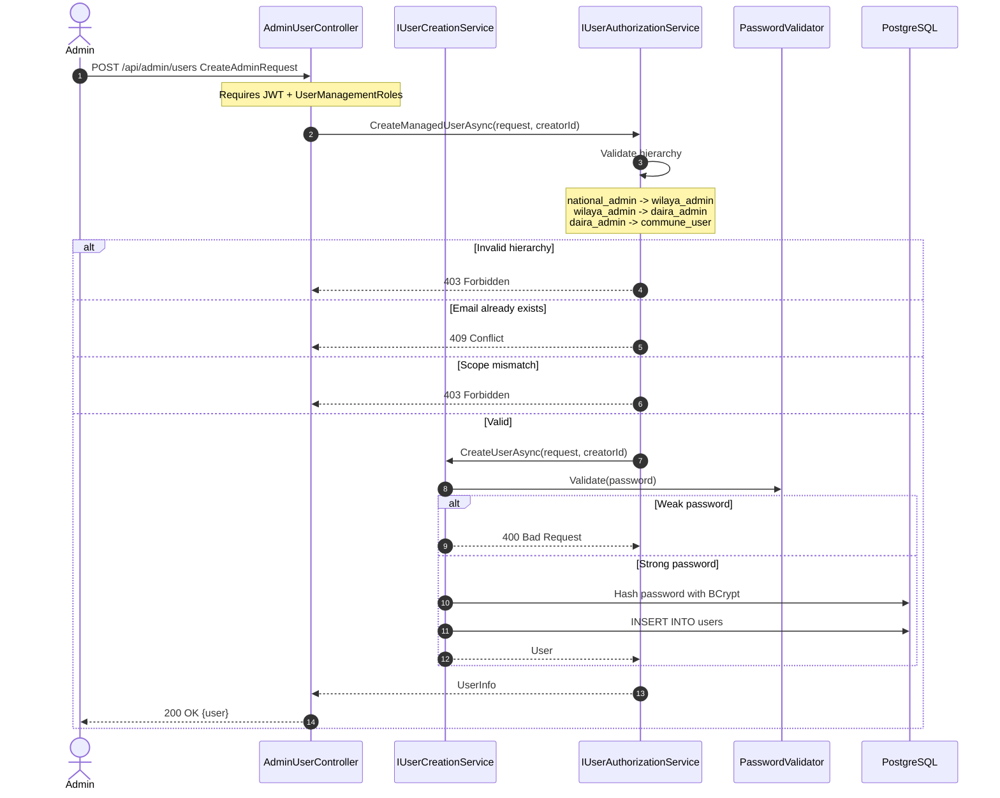
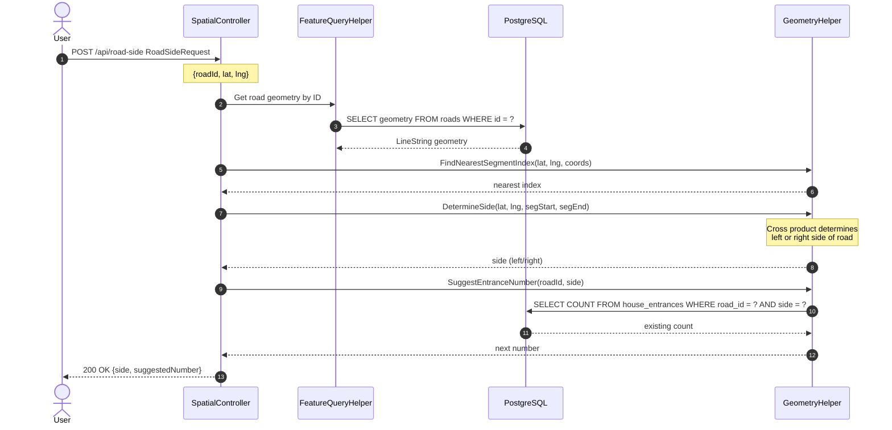

# NARS Backend - Sequence Diagrams

## 1. Sign-In Flow

## 2. Refresh Token Rotation Flow

## 3. Security Stamp Validation (Every Authenticated Request)

## 4. Feature Creation Flow

## 5. Feature Load Flow (Cross-Table Query)

## 6. Admin User Creation Flow

## 7. Road-Side Determination Flow

