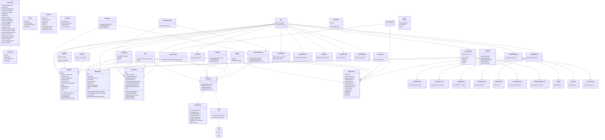

# NARS-Vite Frontend - Component & Architecture Diagram

```mermaid
classDiagram
    %% ===== TYPES =====
    class FeatureData {
        +FeatureTypeKey type
        +string label
        +string? decisionNumber
        +string? decisionDate
        +LatLng[]? coordinates
        +number? lat
        +number? lng
        +number? radius
        +string? areaTypeKey
        +string? districtTypeKey
        +string? roadTypeKey
        +string? roadDbId
        +string? roadLabel
        +left | right? side
        +number? entranceNumber
        +string? mainEntranceDbId
        +string? mainEntranceLabel
        +number? bisNumber
        +string? entranceTypeKey
        +string? spaceTypeKey
        +string? sectorKey
        +string? buildingTypeKey
        +string? geometry
    }

    class LayerEntry {
        +string id
        +string dbId
        +FeatureData data
        +string type
    }

    class Phase {
        +string key
        +string drawType
        +string geometryType
        +string color
    }

    class UserInfo {
        +number id
        +string username
        +string name
        +string email
        +string role
        +LocationInfo commune
        +LocationInfo? daira
        +LocationInfo? wilaya
    }

    class NarsError {
        +ErrorCode code
        +ErrorContext context
        +Date timestamp
        +unknown? cause
    }

    FeatureData o-- LayerEntry

    %% ===== PINIA STORES =====
    class AppStore {
        State
        +number currentPhase
        +UserInfo? user
        +string communeName
        +bool isLoading
        +bool loadError
        +string? referenceRoadDbId
        Getters
        +isAuthenticated
        +isAdminUser
        +counts (from LayerStore)
        Actions
        +setUser(UserInfo)
        +setLoading(bool)
        +setCurrentPhase(number)
    }

    class ModalStore {
        State
        +bool visible
        +number phaseIndex
        +bool isEdit
        +string? editDbId
        +string label
        +string? areaTypeKey
        +string? roadTypeKey
        Actions
        +openCreate(phaseIndex, extras?)
        +openEdit(phaseIndex, dbId, existing)
        +close(result?)
        +patchFields(Partial~ModalState~)
    }

    class LayerStore {
        State
        +LayerEntry[] areas
        +LayerEntry[] cityCenter
        +LayerEntry[] districts
        +LayerEntry[] roads
        +LayerEntry[] houseEntrances
        +LayerEntry[] publicBuildings
        +LayerEntry[] publicSpaces
        +LayerEntry[] namingPanels
        Actions
        +addFeature(LayerEntry)
        +removeFeature(dbId)
        +updateFeature(dbId, data)
        +clearLayer(phase)
        +getFeature(dbId)
    }

    %% ===== SERVICES =====
    class ApiModule {
        +apiFetch(path, options)
        -applyCSRF(options)
        -retryWithBackoff(fn)
        -classifyError(response)
    }

    class ValidationModule {
        +checkDistrictCoverage()
        +checkMainUrbanExists()
        +getRoadSide(roadId, lat, lng)
    }

    class ErrorModule {
        +createNetworkError()
        +createAuthError()
        +createNotFoundError()
        +createServerError()
        +createTimeoutError()
        +createConflictError()
        +withRetry(fn, maxRetries)
        +logError(error)
    }

    class MapContext {
        +Map map
        +Geoman? geoman
        +boundariesSource?
        +scatteredSource?
        +featuresSource?
        +endpointsSource?
        +boundariesGeoJson?
        +scatteredGeoJson?
        +Popup? popup
        +satelliteStyle?
        +streetStyle?
        +lightStyle?
        +darkStyle?
    }

    %% ===== MAP MODULES =====
    class MapInit {
        +initMap()
        +setBaseLayer(key)
    }

    class DrawEvents {
        +watchDrawType()
    }

    class DrawComplete {
        +completeDrawingWithGeometry(geometry)
    }

    class GeomanEvents {
    }

    class EditMode {
        +enableEditMode(featureId?)
        +commitEditMode()
        +cancelEditMode()
    }

    class Snapping {
        +enableSnapping()
        +disableSnapping()
        +findNearestSnap(point)
        +resetSnapping()
        +enableCrosshair()
    }

    class PhaseNav {
        +navigatePhase(direction)
        +goToPhase(target)
        +setPhase(index)
    }

    class HouseNumbering {
        +setHouseNumbers()
    }

    class Undo {
        +recordDelete(entry, phaseKey)
        +undo()
    }

    MapInit --> MapContext
    DrawEvents --> MapContext
    DrawComplete --> MapContext
    DrawComplete --> ModalStore
    DrawComplete --> LayerStore
    GeomanEvents --> MapContext
    GeomanEvents --> DrawComplete
    EditMode --> MapContext
    EditMode --> LayerStore
    Snapping --> MapContext
    PhaseNav --> AppStore
    PhaseNav --> ValidationModule
    HouseNumbering --> LayerStore
    HouseNumbering --> ValidationModule
    Undo --> LayerStore
    Undo --> ApiModule

    MapInit --> ApiModule
    DrawComplete --> ApiModule
    EditMode --> ApiModule

    %% ===== COMPOSABLES =====
    class UseTheme {
        +theme
        +setTheme(value)
    }

    %% ===== COMPONENTS =====
    class App {
        Root Component
        Role-based routing
    }

    class PhaseBar {
        8-phase stepper
        +goToPhase(index)
    }

    class InfoPanel {
        Feature count display
    }

    class ProfileMenu {
        User profile dropdown
        +settings
        +logout
    }

    class TileControl {
        Base layer switcher
    }

    class FeatureModal {
        Phase-specific form
        +openCreate()
        +openEdit()
        +validate()
        +save()
    }

    class SettingsModal {
        Tabbed settings dialog
    }

    class SettingsGeneral {
        Theme/language settings
    }

    class SettingsAccount {
        Profile/password changes
    }

    class SettingsUsers {
        User CRUD + role admin
    }

    class SettingsFeatures {
        Feature type labels
    }

    class SettingsAbout {
        Version info
    }

    class AdminDashboard {
        Role-based monitoring
    }

    class AreaTypeSelector {
        Central/Secondary urban
    }

    class BuildingTypeSelector {
        Cascading sector->type
    }

    class StatPill {
        Statistic display
    }

    class DairaList {
        Daira report list
    }

    class CommuneList {
        Commune report list
    }

    class ContextMenu {
        Right-click context menu
        Edit / Delete actions
    }

    class EditSaveButton {
        Commit/cancel edit button
    }

    class FieldPanel {
        Field-worker feature feed
    }

    class ToastContainer {
        Toast notifications
    }

    class ConfirmDialog {
        Confirmation dialogs
    }

    App --> ProfileMenu
    App --> FeatureModal
    App --> PhaseBar
    App --> InfoPanel
    App --> TileControl
    App --> SettingsModal
    App --> AdminDashboard
    App --> ContextMenu
    App --> EditSaveButton
    App --> FieldPanel
    App --> ToastContainer
    App --> ConfirmDialog

    FeatureModal --> AreaTypeSelector
    FeatureModal --> BuildingTypeSelector

    SettingsModal --> SettingsGeneral
    SettingsModal --> SettingsAccount
    SettingsModal --> SettingsUsers
    SettingsModal --> SettingsFeatures
    SettingsModal --> SettingsAbout

    AdminDashboard --> StatPill
    AdminDashboard --> DairaList
    AdminDashboard --> CommuneList

    %% ===== STORE RELATIONSHIPS =====
    App --> AppStore
    App --> ModalStore
    App --> LayerStore
    FeatureModal --> ModalStore
    PhaseBar --> AppStore
    InfoPanel --> AppStore
    AdminDashboard --> AppStore
    ProfileMenu --> AppStore
    ProfileMenu --> ApiModule

    %% ===== LAYERED ARCHITECTURE =====
    class I18n {
        +t(key)
        +locale
    }

    class Toast {
        +showToast(message, type)
        +showConfirm(message)
    }

    class Config {
        <<static>>
        Phase definitions
        API endpoints
        Colors
    }

    ApiModule --> ErrorModule
    ApiModule --> Toast
    ValidationModule --> ApiModule
    Toast --> I18n
```
