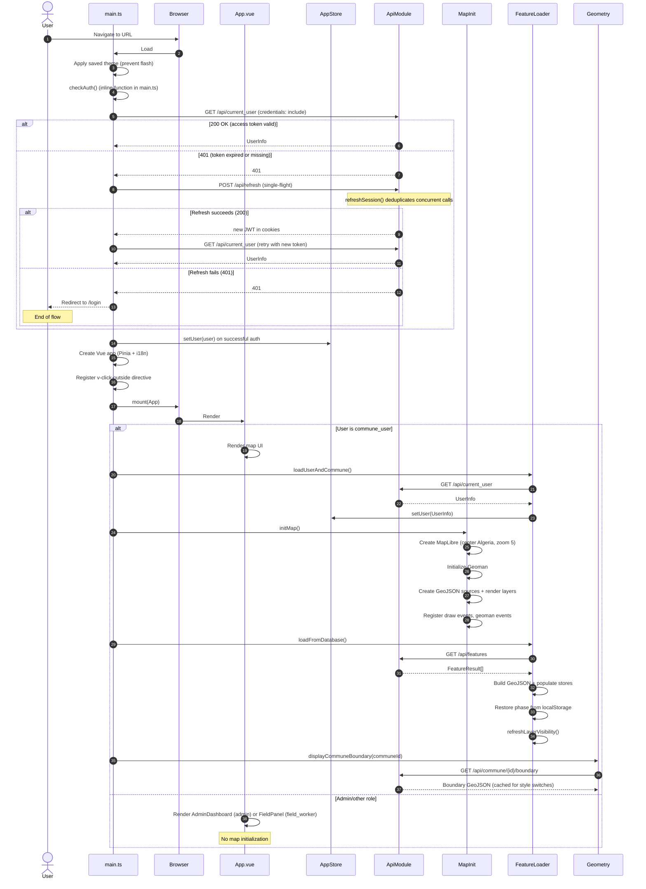
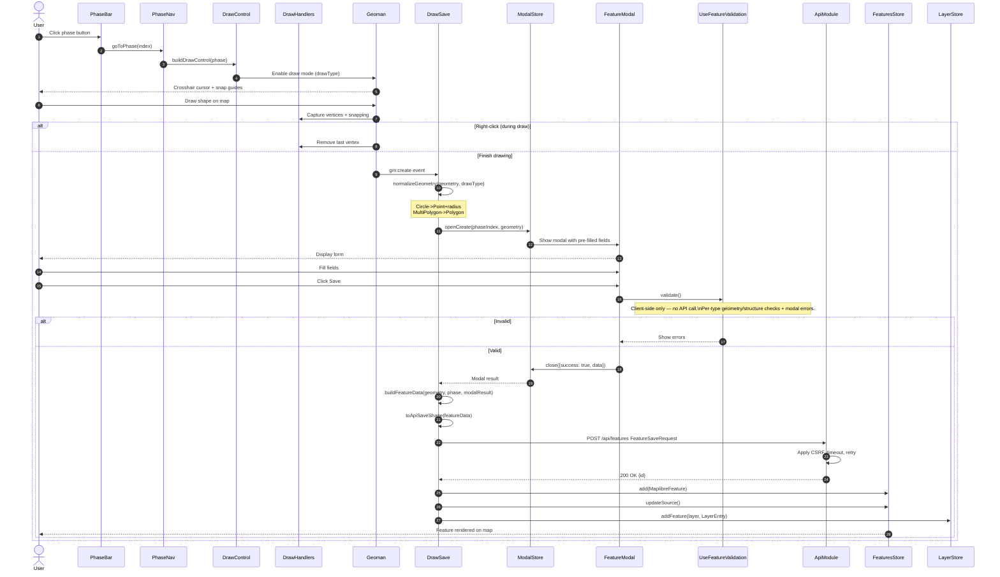
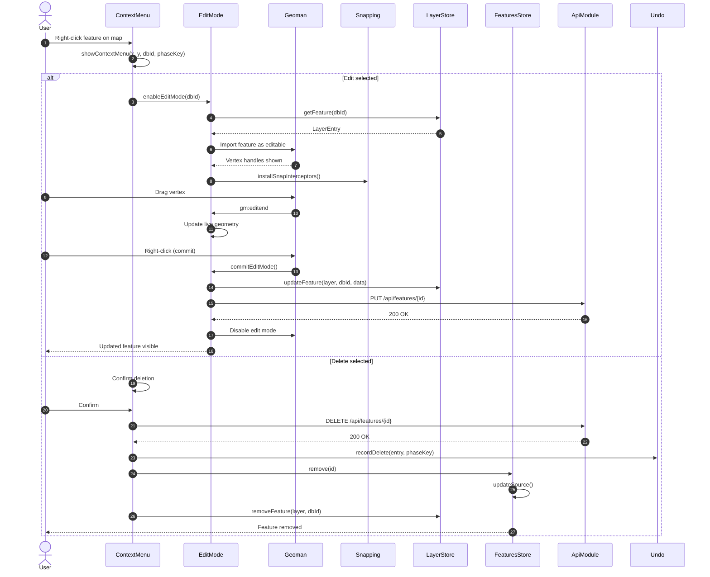
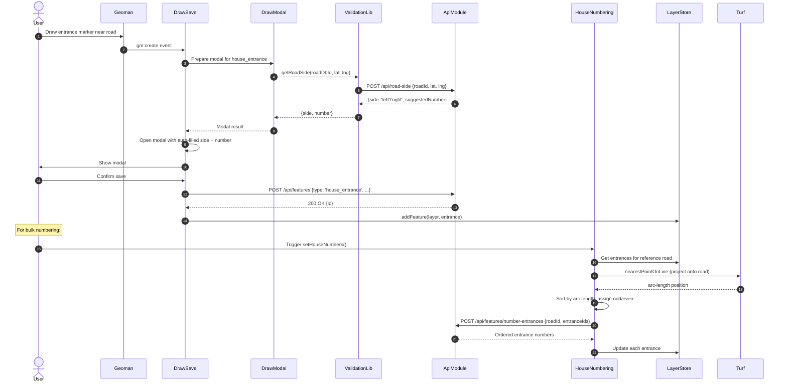

# NARS-Vite Frontend - Sequence Diagrams

## 1. Application Startup & Auth Flow

## 2. Drawing & Feature Creation Flow

## 3. Feature Edit Flow

## 4. Phase Navigation Flow

```mermaid
sequenceDiagram
    autonumber
    actor User
    participant PhaseBar
    participant PhaseNav
    participant LayerStore
    participant ValidationLib
    participant ApiModule
    participant AppStore
    participant LocalStorage
    participant DrawControl
    participant Labels

    User->>PhaseBar: Click "next" phase
    PhaseBar->>PhaseNav: navigatePhase(+1)

    PhaseNav->>PhaseNav: Check prerequisites

    alt Advancing from areas (0->1)
        PhaseNav->>LayerStore: Check $state.areas.length
        alt No urban area created
            PhaseNav-->>User: Show warning toast
        end
    else Advancing from districts (1->2)
        PhaseNav->>ValidationLib: checkDistrictCoverage()
        ValidationLib->>ApiModule: GET /api/validate/districts/coverage
        ApiModule-->>ValidationLib: {covered: bool}
        alt Incomplete coverage
            ValidationLib-->>PhaseNav: false
            PhaseNav-->>User: Show warning toast
        end
    else Advancing from roads (3->4)
        PhaseNav->>LayerStore: Check $state.roads.length
        alt No roads created
            PhaseNav-->>User: Show warning toast
        else Roads exist
            PhaseNav->>PhaseNav: computeAndApplyRoadDirections()
        end
    else Advancing from entrances (4->5)
        PhaseNav->>LayerStore: Check $state.houseEntrances.length
        alt No entrances created
            PhaseNav-->>User: Show warning toast
        end
    else Going backward
        Note over PhaseNav: No validation, direct navigation
    end

    PhaseNav->>AppStore: setPhase(targetIndex)
    AppStore->>LocalStorage: Save phase per commune
    PhaseNav->>DrawControl: buildDrawControl(newPhase)
    PhaseNav->>Labels: refreshLayerVisibility()
    Labels-->>User: UI updated for new phase
```

## 5. House Number Assignment Flow

## 6. Session Refresh Flow (Single-Flight)

```mermaid
sequenceDiagram
    autonumber
    participant Tab1 as Tab 1
    participant Tab2 as Tab 2
    participant refreshPromise as refreshSession()
    participant ApiModule
    participant Server

    Note over Tab1,Tab2: Both tabs detect 401 simultaneously

    Tab1->>refreshPromise: apiFetch() fails -> POST /api/refresh
    Tab2->>refreshPromise: apiFetch() fails -> POST /api/refresh

    Note over refreshPromise: Single-flight dedup:<br/>first caller starts request,<br/>second caller waits on same Promise

    refreshPromise->>ApiModule: POST /api/refresh (only once)
    ApiModule->>Server: Cookie: refresh_token=...
    Server->>Server: SHA-256 hash + validate
    Server->>Server: Revoke old token + issue new
    Server-->>ApiModule: 200 OK + Set-Cookie headers
    ApiModule-->>refreshPromise: Success

    refreshPromise-->>Tab1: Resolve (new token in cookies)
    refreshPromise-->>Tab2: Resolve (same result)

    Tab1->>ApiModule: Retry original request with new cookie
    Tab2->>ApiModule: Retry original request with new cookie
    ApiModule-->>Tab1: 200 OK (data)
    ApiModule-->>Tab2: 200 OK (data)
```

